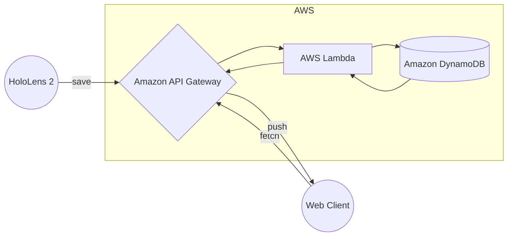

# Talkoger

A prototype of an application to store and view conversations in real time

This application is similar to a logger. The name of this application is derived from it, Talkog is Talk + Logger.

## Actors

- Client (HoloLens 2)
  - Convert the audio of conversations into text and send it to the server
- Client (Web Client)
  - View the text saved on the server
- Server (Amazon API Gateway, AWS Lambda, Amazon DynamoDB)
  - Save and send text



## Communication

Use WebSocket.

### Save a talk

Send data in the following format.

```json
{
  "action": "saveTalk",
  "UserId": "19F095D0-911F-4FAD-B43C-FF06A8E91020", // UUID
  "Talk": "Nice to meet you."
}
```

The response is a status code only.

### Fetch talkogs

Send data in the following format.

```json
{
  "action": "fetchTalkogs",
  "UserId": "19F095D0-911F-4FAD-B43C-FF06A8E91020" // UUID
}
```

The following data will be sent in real time.

```json
{
  "UserId": "19F095D0-911F-4FAD-B43C-FF06A8E91020", // UUID
  "Timestamp": 1657921427, // Unix time
  "Talk": "Nice to meet you."
}
```
